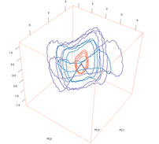

## About

The data set contains 58 time series acquired from 16 chemical sensors under a gas flow modulation. The sensors were exposed to gaseous binary mixtures of acetone and ethanol at different concentrations.

The data set is published the UCI Machine Learning repository, named as [Gas sensor array under flow modulation Data Set](https://archive.ics.uci.edu/ml/datasets/Gas+sensor+array+under+flow+modulation). 

This repository at github.com is intended to collect code examples (R, python, Matlab, etc)
for reproducible analysis applied to the published data.

Figure: PCA trajectories of the sensors' signals pre-processed by a high-pass filter (the first 4 respiration cycles). Trajectories for three gas classes are presented: acetone at 0.05 vol.% (orange), ethanol at 0.01 vol.% (violet) and their binary mixture (blue). See more details on [http://neurochem.sisbio.recerca.upc.edu/?p=311](http://neurochem.sisbio.recerca.upc.edu/?p=311).

## Code examples

* R code: [examples/R](examples/R)

## Publications

* [Ziyatdinov2014]: The first data analysis of the data set was presented in (Ziyatdinov et al., 2014), and the results reported there should be considered as a reference. The study aimed to characterize and explore the sensor signals in response to the modulated gas flow at a fixed respiration frequency. It was expected to confirm a superior performance of the proposed system under the gas flow modulation on the early detection scenario. 

## Note

To be able to run the code, one needs to download the data files `rawdata.csv.gz` and `features.csv` from the UCI Machine Learning Repository website and save them to a local folder named `dat/`.

  [Ziyatdinov2014]: http://www.sciencedirect.com/science/article/pii/S0925400514010703 "Ziyatdinov, A., Fonollosa, J., Fernández, L., Gutiérrez-Gálvez, A., Marco, S., & Perera, A. (2014). Bioinspired Early Detection through Gas Flow Modulation in Chemo-Sensory Systems. Sensors and Actuators B: Chemical. In press."
  
  
## Notes from https://archive.ics.uci.edu/ml/datasets/Gas+sensor+array+under+flow+modulation

         Center for Machine Learning and Intelligent Systems	About  Citation Policy  Donate a Data Set  Contact

 
 Repository  Web            Google
View ALL Data Sets

×Check out the beta version of the new UCI Machine Learning Repository we are currently testing! Contact us if you have any issues, questions, or concerns. Click here to try out the new site.
Gas sensor array under flow modulation Data Set
Download: Data Folder, Data Set Description

Abstract: The data set contains 58 time series acquired from 16 chemical sensors under gas flow modulation conditions. The sensors were exposed to different gaseous binary mixtures of acetone and ethanol.

Data Set Characteristics:  

Multivariate, Time-Series

Number of Instances:

58

Area:

Computer

Attribute Characteristics:

Real

Number of Attributes:

120432

Date Donated

2014-09-10

Associated Tasks:

Classification, Regression

Missing Values?

N/A

Number of Web Hits:

47165

Source:

Creators:
Andrey Ziyatdinov (andrey.ziyatdinov '@' upc.edu)
Department of ESAII, Universitat Politenica de Catalunya, Pau Gargallo 5, Barcelona, Spain
Centro de Investigacion Biomedica en Red en Bioingenierıa, Biomateriales y Nanomedicina (CIBER-BBN), Barcelona, Spain

Jordi Fonollosa (fonollosa '@' ucsd.edu)
BioCircuits Institute, University of California, San Diego, La Jolla, CA 92093, USA

Donors:

Luis Fernandez (lfernandez '@' el.ub.es)
Agustin Gutierrez-Galvez (agutierrez '@' el.ub.es)
Santiago Marco (smarco '@' el.ub.es)
Signal and Information Processing for Sensing Systems Institute for Bioengineering of Catalonia (IBEC), Baldiri Reixac, 4-8, 08028 Barcelona, Spain
Departament dElectronica, Universitat de Barcelona, Marti i Franques 1, 08028 Barcelona, Spain

Alexandre Perera (Alexandre.Perera '@' upc.edu)
Department of ESAII, Universitat Politenica de Catalunya, Pau Gargallo 5, Barcelona, Spain
Centro de Investigacion Biomedica en Red en Bioingenierıa, Biomateriales y Nanomedicina (CIBER-BBN), Barcelona, Spain

Data Set Information:

The measured data was collected using a chemical sensing system based on an array of 16 metal-oxide gas sensors and an external mechanical ventilator to simulate the biological respiration cycle. The tested gas classes (12 in total) formed a relatively broad combination of two analytes, acetone and ethanol, in binary mixtures. Both, raw data set and feature data set, are available. In particular, two sets of low-frequency and high-frequency features are provided for a comparison study.

The primary data analysis is supposed to be a multivariate regression with multiple responses (two responses), where the predictors were the features extracted from the sensor signals and the responses were the concentrations of two analytes, acetone and ethanol. This task is also known as a mixture quantification problem of two analytes. Please see the article (Ziyatdinov et al., 2014, Section 3.2) for such regression analysis based on partial least squares (PLS). A classification task is also possible given that a small number of samples per class is available, if all the 12 classes are used. Another classification problem can be stated to distinguish two pure analytes and mixtures of them.

Three concentrations doses 0.1, 0.3 and 1 vol.% were used to prepare the dilutions in water for the pure analytes. The same dilutions were used to generate gas mixtures. The gas classes included samples of pure ethanol ('lab' attribute eth-0.1, eth-0.3 and eth-1), samples of pure acetone (ace-0.1, ace-0.3 and ace-1), samples of binary mixtures of ethanol and acetone (ace-0.1-eth-0.1, ace-0.1-eth-0.3, ace-0.3-eth-0.1, ace-0.1-eth-1 and ace-1-eth-0.1) and samples of water dilutions without any analyte (air) giving a total number of 12 classes. The choice of these analytes and concentrations was not affected by any particular application constraint, except that the sensors of selected models show consistent and diverse responses among the gas classes. The statistics on class distribution among 58 samples:

eth-0.1: 6
eth-0.3: 4
eth-1: 5
ace-0.1: 6
ace-0.3: 6
ace-1: 3
ace-0.1-eth-0.1: 4
ace-0.1-eth-0.3: 5
ace-0.3-eth-0.1: 5
ace-0.1-eth-1: 3
ace-1-eth-0.1: 3
air: 8

The measurements were split into 5 batches ('batch' attribute), where each batch contained records approximately for all gas classes given in a random order. All the batches were collected in a time period of 4 days to minimize the effect of the long-term internal and environmental noise in the system. The statistics on batch distribution among 58 samples:

day-1-morning: 19
day-2-afternoon: 10
day-2-morning: 10
day-3-morning: 11
day-4-afternoon: 8

The array was composed of 16 metal-oxide gas sensors of 5 different TGS models from Figaro Inc. The sensors were configured for 10 different sensor conditioning profiles based on the combination of 5 TGS models and 2 sensor operating temperatures. The circuit board with the gas sensor array was placed in a 70 ml inner volume chamber connected to the mechanical ventilator. The device of the mechanical ventilator was made commercially available from Harvard Apparatus (Harvard Apparatus, Harvard Inspira Advanced Safety Ventilator Manual, Tech. rep., 2003). The mechanical ventilator includes a cylinder of volume 63.44 cm3 and a mechanical pump that takes air from the outlet 'Source' and pushes the air sample through the outlet 'To Animal'. The system also receives the sample again in the outlet 'From Animal' to close the loop, control the air pressure decay, and collect the exhaled air. The cylinder of the ventilator was fixed to a frequency of 5 breaths per minute, approximately equivalent to 0.08 Hz for all the measurements. See the article (Ziyatdinov et al., 2014, Section 2.1) for a detailed description of the experimental set up.

The measurement protocol was the following: using a micropipette we delivered 10 μl of the corresponding dilution to the vessel, which in turn was connected to the apparatus 'Source' channel to expose the sensor array to the generated gas sample. After 3 min of exposition, the source of the gas vapour was removed from the vessel to start the recovery phase. During the recovery phase, the system was sampling room air for 2 additional minutes to record the decay in the sensors signals. The recorded time-series signal for each sensor was acquired at the sampling frequency of 25 Hz during 5 min, resulting in 7500 data points per time-series of a single sensor. Note that 2 minutes of recovery phase was not sufficient to recover the sensors baseline and re-establish again the initial conditions in the gas chamber. Hence, although we acquired 2 minutes of recovery phase, the system was pumping air until the sensors recovered the baseline and the whole gas sample was exhausted from the gas chamber.

The readout data was the output voltage of the sensor stored as resistance values according to the voltage-divider scheme and using the value of the load resistor. Hence, each data point in the array described the resistance of a sensor R(t) at a certain time of measurement t. The resistance
values in the data set were normalized by subtracting the baseline value R0 = R(t0) at the
starting point of the measurement t0 and scaling by factor R0, (R(t) − R0)/R0. Note that such format of the measured raw data allows for comparison of responses among different sensors.

Previously to computing the low-frequency and high-frequency features, the raw data were pre-processed by a set of digital filters. A median filter was used to remove the spikes in the signals. Then we employed two Butterworth filters of 3rd order: a low-pass filter (cut-off frequency 0.01 Hz) and a high-pass filter (pass-frequency 0.07 Hz) to generate the low/high frequency signals, respectively. Note that these low/high frequency signals (output of the two Butterworth filters) are not distributed within the data set.

For feature extraction, both low-frequency and high-frequency sensor signals were divided by respiratory cycles, where each cycle was processed independently. Thus, a feature is referred to as a feature by respiratory cycle. Since high-frequency signals showed oscillatory behavior similar to a sine wave curve, we decided to follow a straightforward strategy for feature extraction in this case. We used amplitude of the high-frequency signal (oscillation) at every respiratory cycle as a feature. Low-frequency trajectories had a monotonic behaviour, and we used the magnitude of the low-frequency signal as a feature at every respiratory cycle. The magnitude value was taken at the same time of oscillation, where the amplitude of the high-frequency signal was measured. Note that the low-frequency and high-frequency features were computed only for the first 13 respiration cycles.

In addition to the low/high frequency features, we also introduced a cycle-independent feature per
single measurement, defined as the maximum of the low-frequency signal over the course of
the measurement.

The first data analysis of the data set was presented in (Ziyatdinov et al., 2014), and the results reported there should be considered as a reference. The study aimed to characterize and explore the sensor signals in response to the modulated gas flow at a fixed respiration frequency. It was expected to confirm a superior performance of the proposed system under the gas flow modulation on the early detection scenario. The acquired modulated signals were decomposed into low-frequency and high-frequency components, and the resulted feature sets were compared in terms of the discrimination performance. Note that it was assumed that the low-frequency part of the modulated signals approximate the signals that would be measured under the standard constant flow rate mode (such assumption was empirically confirmed by observing the transient dynamics).

The strategy in signal- and data-processing applied in (Ziyatdinov et al., 2014) was straightforward, and the analysis can be improved in a number of ways, on the stages of feature extraction and/or pattern recognition. Hence, the raw data stored in 'rawdata.csv.gz' file is intended for testing feature extraction methods, while the features computed in (Ziyatdinov et al., 2014) and stored in 'features.csv' can be readily used in testing pattern recognition methods.

Additional links:
1. Data vizualization of time series in the data set: [Web Link].
2. Code repository for reproducible analysis applied to the data set: [Web Link].

Attribute Information:

The data set is organized in two 'csv' files, 'rawdata.csv.gz' (4.5 MB) and 'features.csv' (200 kB). The raw data are stored in the first file 'rawdata.csv.gz', where each line represents a single measurement per sensor. Consequently, one needs to read specific 16 consecutive lines to get a single measurement from 16 sensors. The features extracted in (Ziyatdinov et al., 2014) are provided in the second file 'features.csv', where each line represents features extracted from all 16 time-series of the sensors (a single measurement).

Raw data of each sample contains 16 time-series (one time-series per sensor). Each time-series was recorded during 5 min at a sample rate of 25 Hz (samples per second), providing 7500 data points per time-series. The total number of attributes per sample in raw data is 120000.

Feature data set includes three types of features extracted from each time-series. Each time-series (one time-series per sensor) is associated with 1 maximum features, 13 high-frequency features and 13 low-frequency features (the features correspond to the first 13 respiration cycles, respectively). The total number of attributes per sample in feature data set is 432.

Both tables of the raw data and features have common attributes:
'exp': integer (range 100-181); represents the experiment number registered in the laboratory.
'batch': string (5 values); represents the batch identificator of the measurements;
'ace_conc': float (range 0-1); the concentration of the acetone analyte given in vol.%;
'eth_conc': float (range 0-1); the concentration of the ethanol analyte given in vol.%;
'lab': string (12 values); the class label of the gas;
'gas': string (4 values); another class label that encodes either pure analytes, mixture or air;
'col': string (12 values); the color code for better plotting among the class labels.

The table of the raw data has specific attributes:
'sensor': integer (range 1-16); the sensor number;
'sample': integer (range 1-58); the sample number;
'dR_t': float; represents the value of the time series for a given sensor and for a given sample, which were measured at the time instant , where takes the value from 1 to 7500.

The table of the features has specific attributes:
'S_max': float; represents the value of the maximum feature extracted from the time-series of sensor ;
'S_r_Alf': float; represents the low-frequency feature extracted from the time-series of sensor at the respiration , where takes the value from 1 to 16, takes the value from 1 to 13;
'S_r_Ahf': float; represents the high-frequency feature extracted from the time-series of sensor at the respiration , where takes the value from 1 to 16, takes the value from 1 to 13.

Relevant Papers:

N/A

Citation Request:

Please cite the following paper if you use this data set:

A Ziyatdinov, J Fonollosa, L Fernandez, A Gutierrez-Galvez, S Marco, A Perera. "Bioinspired early detection through gas flow modulation in chemo-sensory systems." Sensors and Actuators B: Chemical 206 (2015): 538-547.

This work was funded from the European Community's Seventh Framework Programme (FP7/2007-2013) under grant agreement no. 216916: Biologically inspired computation for chemical sensing (NEUROChem).

Supported By:

	
 In Collaboration With:

About  ||  Citation Policy  ||  Donation Policy  ||  Contact  ||  CML
