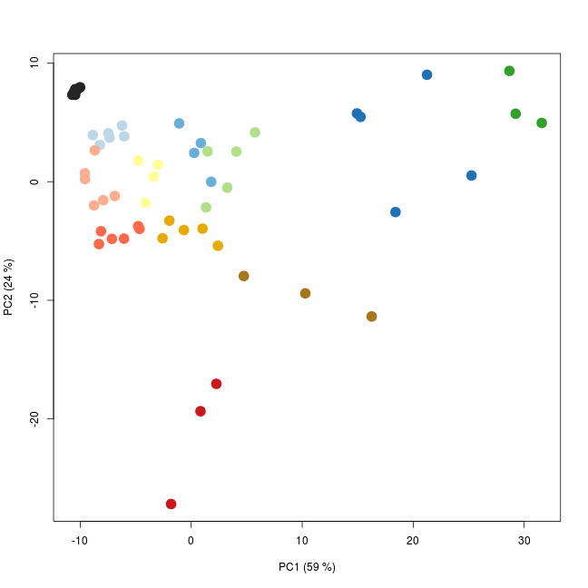

% Example on reading the features in R
% Andrey Ziyatdinov
% 05/09/2014


## About

This document shows an example of code in R,
in order to read the `features.csv` of the `pulmon` data set published on 
[The UC Irvine Machine Learning Repository](http://archive.ics.uci.edu/ml/).

A particular example of data analysis is a PCA on the high-frequency `Ahf` features,
that reproduces the results obtained in [Ziyatdinov et al., 2014](http://www.journals.elsevier.com/sensors-and-actuators-b-chemical/),
Section 3.1, Figure 4 c.

## How to reproduce this report

The working directory:

```r
getwd()
```

```
## [1] "/home/andrey/git/variani/pulmon/examples/R/01-read-features"
```

Run the following commands in R:

```
library(knitr)
knit2html("01-read-features.Rmd")
```

That results in two output files: `*.md` (for github) and `*.html` (for browsing locally on your computer).

## Data files

For this report the data files are stored in:


```r
dat.dir <- "../../../dat"

list.files(dat.dir)
```

```
## [1] "features.csv"   "rawdata.csv.gz"
```

## Demo


```r
### inc
library(plyr)
library(ggplot2)

library(pls)

### options
options(stringsAsFactors = FALSE)
```


```r
### data
dat <- read.table(file.path(dat.dir, "features.csv"), header = TRUE, sep = ",")
head(colnames(dat), 30)
```

```
##  [1] "exp"       "batch"     "ace_conc"  "eth_conc"  "gas"      
##  [6] "lab"       "col"       "S1_max"    "S2_max"    "S3_max"   
## [11] "S4_max"    "S5_max"    "S6_max"    "S7_max"    "S8_max"   
## [16] "S9_max"    "S10_max"   "S11_max"   "S12_max"   "S13_max"  
## [21] "S14_max"   "S15_max"   "S16_max"   "S1_r1_Alf" "S1_r2_Alf"
## [26] "S1_r3_Alf" "S1_r4_Alf" "S1_r5_Alf" "S1_r6_Alf" "S1_r7_Alf"
```


```r
### PCA
ind <- grep("Ahf", colnames(dat))
X <- dat[, ind]

Y <- dat$lab

cols <- dat$col
cols <- paste0("#", cols)

mod <- prcomp(X, center = TRUE, scale = TRUE)

### plot
scoreplot(mod, col = cols, pch = 20, cex = 3)
```

 
